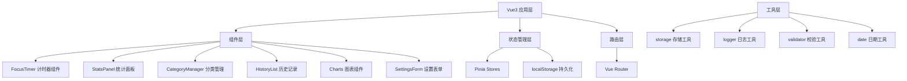

## 1. 架构设计



## 2. 技术栈

- **前端框架**：Vue 3.4 + TypeScript 5.4
- **构建工具**：Vite 5.2
- **状态管理**：Pinia 2.1
- **路由**：Vue Router 4.3
- **样式**：Tailwind CSS 3.4
- **图表**：ECharts 5.5
- **图标**：Lucide Vue Next 0.4
- **存储**：localStorage

## 3. 目录结构

```
src/
├── components/          # 可复用组件
│   ├── FocusTimer.vue
│   ├── StatsCard.vue
│   ├── StatsPanel.vue
│   ├── CategoryCard.vue
│   ├── CategoryForm.vue
│   ├── HistoryItem.vue
│   ├── DateRangePicker.vue
│   ├── TrendChart.vue
│   ├── PieChart.vue
│   ├── HeatmapChart.vue
│   └── ToastMessage.vue
├── views/              # 页面组件
│   ├── Dashboard.vue
│   ├── History.vue
│   ├── Statistics.vue
│   ├── Categories.vue
│   └── Settings.vue
├── stores/             # Pinia 状态管理
│   ├── timer.ts
│   ├── categories.ts
│   ├── records.ts
│   ├── settings.ts
│   └── logger.ts
├── composables/        # 组合式函数
│   ├── useTimer.ts
│   ├── useStorage.ts
│   └── useToast.ts
├── utils/              # 工具函数
│   ├── storage.ts
│   ├── logger.ts
│   ├── validator.ts
│   └── date.ts
├── types/              # TypeScript 类型定义
│   └── index.ts
├── router/             # 路由配置
│   └── index.ts
├── App.vue
└── main.ts
```

## 4. 路由定义

| 路由路径 | 页面名称 | 说明 |
|---------|---------|------|
| / | 仪表盘 | 计时器 + 今日统计 |
| /history | 历史记录 | 专注历史列表与筛选 |
| /statistics | 数据统计 | 图表可视化 |
| /categories | 分类管理 | 分类CRUD |
| /settings | 应用设置 | 配置项管理 |

## 5. 数据模型

### 5.1 类型定义

```typescript
interface Category {
  id: string;
  name: string;
  color: string;
  icon: string;
  createdAt: number;
}

interface FocusRecord {
  id: string;
  categoryId: string;
  mode: 'pomodoro' | 'custom';
  duration: number;        // 实际专注时长（秒）
  plannedDuration: number; // 计划时长（秒）
  startTime: number;
  endTime: number;
  completed: boolean;      // 是否正常完成
}

interface Settings {
  pomodoroDuration: number;      // 番茄时长（分钟）
  shortBreakDuration: number;    // 短休息（分钟）
  longBreakDuration: number;     // 长休息（分钟）
  longBreakInterval: number;     // 长休息间隔（番茄数）
  soundEnabled: boolean;
  darkMode: boolean;
  autoStartBreak: boolean;
  autoStartFocus: boolean;
}

interface LogEntry {
  id: string;
  timestamp: number;
  level: 'info' | 'warn' | 'error';
  message: string;
  data?: any;
}
```

### 5.2 存储键名

```
focus_categories    - 分类列表
focus_records       - 专注记录
focus_settings      - 应用设置
focus_logs          - 操作日志
```

## 6. 状态管理设计

### 6.1 Timer Store
- 当前计时状态（idle/running/paused）
- 剩余时间
- 当前选择的分类
- 开始/暂停/结束方法

### 6.2 Categories Store
- 分类列表CRUD
- 默认分类管理

### 6.3 Records Store
- 专注记录管理
- 统计计算（今日、本周、本月）
- 筛选查询

### 6.4 Settings Store
- 配置项读写
- 配置变更监听
- 导入导出

## 7. 关键特性实现

### 7.1 异常处理
- Storage工具封装try-catch
- JSON解析错误处理
- 存储配额检测
- 用户友好的错误提示

### 7.2 数据校验
- 时长必须为正数
- 分类名称必填且唯一
- 日期范围合法性检查
- 导入数据格式校验

### 7.3 操作日志
- 记录开始/结束专注
- 记录分类增删改
- 记录配置变更
- 记录数据导入导出
- 日志持久化（最近1000条）
