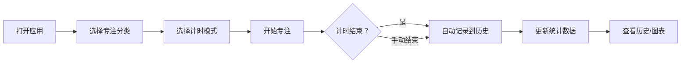

## 1. 产品概述

个人专注与时间统计仪表盘是一款帮助用户管理专注力、追踪时间投入的Web应用。通过番茄工作法、自定义计时、分类管理和数据可视化，帮助用户建立良好的专注习惯，提升工作效率。

- 核心价值：让专注可见，让习惯可量化
- 目标用户：学生、程序员、自由职业者等需要管理时间的人群

## 2. 核心功能

### 2.1 功能模块

1. **专注计时器**：番茄钟模式（25分钟+5分钟休息）、自定义时长模式，支持暂停/继续/手动结束，结束自动记录
2. **今日统计面板**：今日专注总时长、完成番茄数、最长连续专注时间、当前连续天数
3. **分类管理**：创建/编辑/删除分类，设置名称、颜色、图标
4. **历史记录**：按日期分组展示，支持分类和日期范围筛选，查看每日时间分布详情
5. **数据可视化**：本周/本月专注趋势图、分类占比饼图、每日时段热力图
6. **本地存储**：localStorage持久化，JSON导出备份，从备份恢复
7. **应用设置**：番茄时长配置、休息时长、声音提醒、深色模式切换

### 2.2 页面详情

| 页面名称 | 模块名称 | 功能描述 |
|-----------|-------------|---------------------|
| 仪表盘首页 | 专注计时器 | 模式切换、开始/暂停/结束、分类选择、倒计时显示 |
| 仪表盘首页 | 今日统计 | 四项核心数据卡片展示 |
| 历史记录 | 记录列表 | 按日期分组、筛选功能、展开查看详情 |
| 数据统计 | 图表展示 | 趋势图、饼图、热力图 |
| 分类管理 | 分类CRUD | 创建编辑删除分类，颜色图标选择 |
| 设置页面 | 配置项 | 时长配置、声音开关、深色模式、数据导入导出 |

## 3. 核心流程

## 4. 用户界面设计

### 4.1 设计风格

- **主色调**：靛蓝色系（#6366f1），代表专注与理性
- **辅助色**：绿色（#10b981）表示进行中，橙色（#f59e0b）表示休息，红色（#ef4444）表示警告
- **字体**：现代无衬线字体，清晰易读
- **布局**：卡片式布局，顶部导航+侧边栏（移动端底部导航）
- **图标**：使用Lucide图标库，线性风格

### 4.2 页面设计

| 页面名称 | 模块名称 | UI元素 |
|-----------|-------------|-------------|
| 仪表盘 | 计时器 | 圆形倒计时进度条、大字号时间显示、控制按钮组 |
| 仪表盘 | 统计卡片 | 四格卡片网格，图标+数值+趋势指示 |
| 历史记录 | 日期分组 | 可折叠日期区块，时间轴样式展示记录 |
| 数据统计 | 图表区域 | 响应式图表容器，支持切换时间范围 |
| 分类管理 | 分类列表 | 网格布局，彩色卡片展示分类 |
| 设置页面 | 配置表单 | 分组表单，开关、滑块、输入框组合 |

### 4.3 响应式

- 桌面端：侧边导航 + 主内容区
- 平板端：顶部导航 + 网格布局
- 移动端：底部Tab导航 + 单列布局
- 触摸优化：按钮最小48x48px，足够间距

## 5. 技术特性

- 数据边界校验：时长不能为负，分类名称必填
- 异常捕获：存储读写失败提示，JSON解析错误处理
- 操作日志：记录关键操作，方便排查问题
- 实时响应：配置变更立即生效
