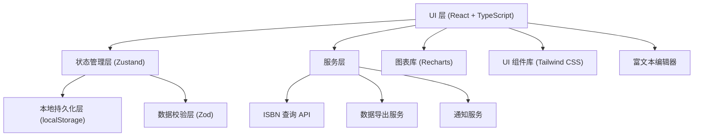
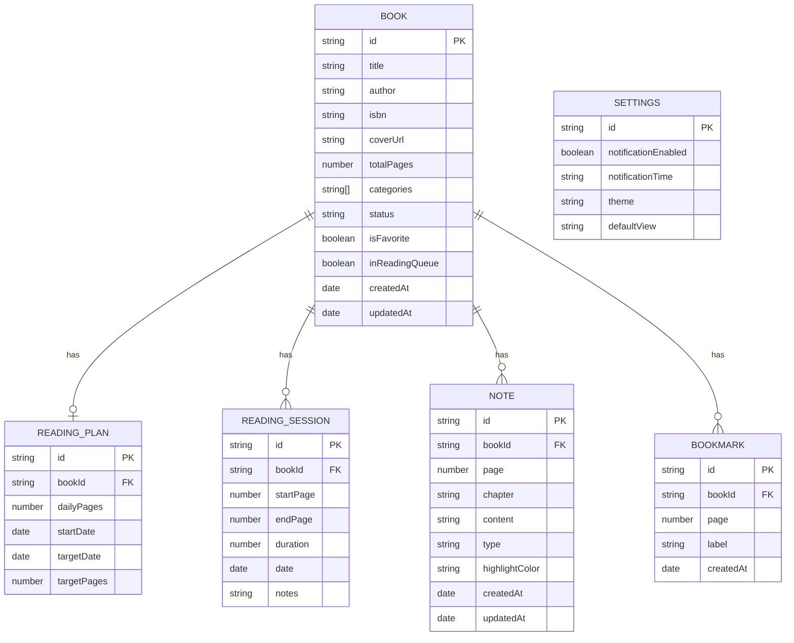

## 1. 架构设计



## 2. 技术描述

- **前端框架**: React 18 + TypeScript 5
- **构建工具**: Vite 5
- **状态管理**: Zustand (轻量级，支持中间件持久化)
- **路由**: React Router v6
- **样式**: Tailwind CSS 4 + CSS Variables
- **数据校验**: Zod
- **图表**: Recharts
- **图标**: Lucide React
- **富文本编辑**: Tiptap
- **日期处理**: date-fns
- **本地存储**: localStorage + zustand-persist
- **HTTP 客户端**: fetch API (原生)
- **代码质量**: ESLint + Prettier

## 3. 目录结构

```
src/
├── components/          # 可复用组件
│   ├── ui/             # 基础UI组件 (Button, Card, Modal, etc.)
│   ├── layout/         # 布局组件 (Sidebar, Header, etc.)
│   ├── books/          # 书籍相关组件
│   ├── dashboard/      # 仪表盘组件
│   ├── notes/          # 笔记相关组件
│   └── common/         # 通用组件
├── pages/              # 页面组件
│   ├── Dashboard.tsx
│   ├── Shelf.tsx
│   ├── BookDetail.tsx
│   ├── AddBook.tsx
│   ├── Notes.tsx
│   └── Settings.tsx
├── store/              # Zustand stores
│   ├── useBookStore.ts
│   ├── useNoteStore.ts
│   ├── useReadingStore.ts
│   └── useSettingsStore.ts
├── types/              # TypeScript 类型定义
│   ├── book.ts
│   ├── note.ts
│   ├── reading.ts
│   └── settings.ts
├── utils/              # 工具函数
│   ├── storage.ts
│   ├── date.ts
│   ├── export.ts
│   ├── validation.ts
│   └── logger.ts
├── services/           # 服务层
│   ├── isbnService.ts
│   ├── notificationService.ts
│   └── exportService.ts
├── hooks/              # 自定义 Hooks
│   ├── useReadingProgress.ts
│   ├── useNotification.ts
│   └── useLocalStorage.ts
├── constants/          # 常量配置
│   ├── config.ts
│   └── categories.ts
├── App.tsx
├── main.tsx
└── index.css
```

## 4. 路由定义

| 路由 | 页面 | 用途 |
|-----|------|------|
| / | Dashboard | 仪表盘首页 |
| /shelf | Shelf | 书架管理 |
| /book/:id | BookDetail | 书籍详情 |
| /add-book | AddBook | 添加新书 |
| /notes | Notes | 笔记管理 |
| /settings | Settings | 设置页面 |

## 5. 数据模型

### 5.1 数据模型定义



### 5.2 核心类型定义

```typescript
// 书籍状态
type BookStatus = 'unread' | 'reading' | 'completed' | 'paused';

// 笔记类型
type NoteType = 'note' | 'highlight' | 'bookmark';

interface Book {
  id: string;
  title: string;
  author: string;
  isbn?: string;
  coverUrl?: string;
  totalPages: number;
  categories: string[];
  status: BookStatus;
  isFavorite: boolean;
  inReadingQueue: boolean;
  currentPage: number;
  createdAt: string;
  updatedAt: string;
}

interface ReadingPlan {
  id: string;
  bookId: string;
  dailyPages: number;
  startDate: string;
  targetDate: string;
}

interface ReadingSession {
  id: string;
  bookId: string;
  startPage: number;
  endPage: number;
  duration: number; // 分钟
  date: string;
  notes?: string;
}

interface Note {
  id: string;
  bookId: string;
  page: number;
  chapter?: string;
  content: string;
  type: NoteType;
  highlightColor?: string;
  createdAt: string;
  updatedAt: string;
}

interface Bookmark {
  id: string;
  bookId: string;
  page: number;
  label: string;
  createdAt: string;
}

interface Settings {
  notificationEnabled: boolean;
  notificationTime: string; // HH:mm 格式
  theme: 'light' | 'dark' | 'system';
  defaultView: 'grid' | 'list';
}
```

## 6. 状态管理设计

### 6.1 Book Store
- 书籍 CRUD 操作
- 按状态/分类/标签筛选
- 搜索功能
- 收藏/取消收藏
- 加入/移出阅读队列

### 6.2 Reading Store
- 阅读计划管理
- 阅读记录管理
- 进度计算
- 统计数据生成

### 6.3 Note Store
- 笔记 CRUD
- 高亮管理
- 书签管理

### 6.4 Settings Store
- 提醒设置
- 主题设置
- 应用配置

## 7. 核心业务逻辑

### 7.1 阅读进度计算
```typescript
function calculateProgress(currentPage: number, totalPages: number): number {
  if (totalPages <= 0) return 0;
  return Math.min(Math.round((currentPage / totalPages) * 100), 100);
}

function calculateEstimatedCompletion(
  remainingPages: number,
  dailyPages: number
): Date {
  const daysNeeded = Math.ceil(remainingPages / dailyPages);
  const result = new Date();
  result.setDate(result.getDate() + daysNeeded);
  return result;
}
```

### 7.2 边界条件处理
- 阅读页数校验：`endPage <= totalPages` 且 `endPage > startPage`
- 计划日期校验：`targetDate >= startDate` 且 `startDate >= today`
- 进度上限：不超过 100%
- 数据删除确认：二次确认对话框

### 7.3 异常处理
- ISBN 查询失败：降级到手动输入
- 本地存储异常：内存回退 + 错误提示
- 通知权限拒绝：优雅降级，提示用户手动开启
- JSON 解析错误：数据恢复机制

## 8. 安全与性能

### 8.1 数据安全
- 所有用户数据本地存储，不上传服务器
- 导出数据包含完整备份
- 支持数据导入恢复

### 8.2 性能优化
- 列表虚拟化（大量书籍时）
- 防抖搜索
- 懒加载封面图片
- 存储数据分片
- 定期清理过期日志
