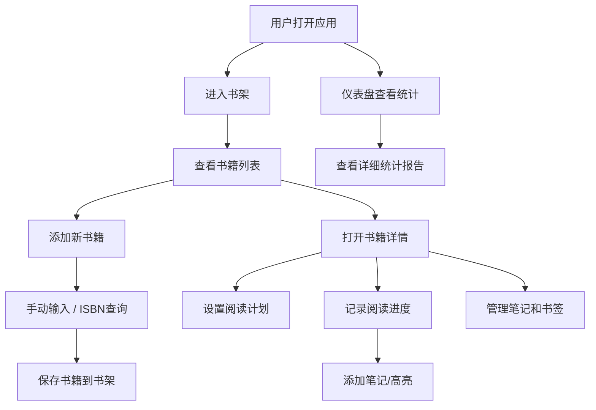

## 1. 产品概述

个人阅读计划与书籍管理Web应用，帮助用户系统化管理阅读生活，追踪阅读进度，建立良好阅读习惯。面向所有热爱阅读、需要系统化管理个人书库和阅读计划的用户。

- 核心价值：提供一站式书籍管理、阅读计划、进度追踪和数据分析解决方案
- 解决问题：碎片化阅读难以追踪、阅读计划难以执行、阅读数据难以统计

## 2. 核心特性

### 2.1 用户角色

| 角色 | 注册方式 | 核心权限 |
|------|----------|----------|
| 普通用户 | 无需注册，本地存储 | 完整使用所有功能，数据本地持久化 |

### 2.2 功能模块

1. **仪表盘**：阅读统计概览、进度图表、阅读日历
2. **书架管理**：书籍列表、分类筛选、搜索、收藏夹、阅读队列
3. **书籍详情**：书籍信息、阅读计划、进度追踪、笔记管理
4. **添加书籍**：手动输入、ISBN在线查询
5. **阅读记录**：记录阅读 session、笔记、高亮
6. **笔记管理**：富文本笔记、书签、高亮管理
7. **设置**：提醒设置、数据导出、应用配置
8. **统计报告**：周/月阅读趋势、阅读速度、完成书籍统计

### 2.3 页面详情

| 页面名称 | 模块名称 | 功能描述 |
|---------|---------|----------|
| 仪表盘 | 统计概览 | 展示本周/本月阅读时长、完成书籍、连续阅读天数 |
| 仪表盘 | 阅读趋势 | 周/月阅读时长趋势图表 |
| 仪表盘 | 阅读日历 | 热力图展示每日阅读情况 |
| 书架 | 书籍列表 | 网格/列表视图切换、分类标签筛选 |
| 书架 | 搜索排序 | 按书名、作者搜索，按阅读状态、添加时间排序 |
| 书架 | 收藏队列 | 收藏夹和阅读队列快捷入口 |
| 书籍详情 | 基础信息 | 书名、作者、封面、页数、分类标签、阅读状态 |
| 书籍详情 | 阅读计划 | 设置目标、每日页数、预计完成日期、自动计算进度 |
| 书籍详情 | 阅读记录 | 起始页、结束页、阅读时长、添加笔记 |
| 书籍详情 | 笔记列表 | 章节笔记、高亮文本、书签 |
| 添加书籍 | 手动添加 | 表单输入书籍所有信息 |
| 添加书籍 | ISBN查询 | 输入ISBN自动获取书籍信息 |
| 笔记管理 | 笔记编辑 | 富文本编辑器编辑笔记内容 |
| 笔记管理 | 高亮管理 | 添加、编辑、删除高亮标记 |
| 笔记管理 | 书签管理 | 添加、编辑、删除书签 |
| 设置 | 提醒设置 | 设置每日阅读提醒时间 |
| 设置 | 数据导出 | 导出JSON/CSV格式数据 |
| 设置 | 应用配置 | 主题切换、数据清理、备份恢复 |

## 3. 核心流程

## 4. 用户界面设计

### 4.1 设计风格

- **主色调**：深蓝色 #1e3a5f（知识、专注），搭配暖橙色 #f59e0b（活力、热情）作为强调色
- **辅助色**：柔和的绿色 #10b981（进度完成）、红色 #ef4444（警告/删除）
- **背景**：浅灰蓝渐变背景，营造宁静阅读氛围
- **字体**：展示字体使用 Playfair Display，正文字体使用 Inter
- **卡片风格**：圆角16px，柔和阴影，悬停时轻微上浮
- **图标风格**：线性图标，统一2px描边

### 4.2 页面设计概览

| 页面名称 | 模块名称 | UI 元素 |
|---------|---------|---------|
| 仪表盘 | 统计概览 | 4个统计卡片网格，带图标和趋势指示器 |
| 仪表盘 | 阅读趋势 | 面积图展示周/月数据，可切换时间维度 |
| 仪表盘 | 阅读日历 | 热力图日历，颜色深浅表示阅读时长 |
| 书架 | 书籍卡片 | 封面图为主，底部显示标题、进度条、状态标签 |
| 书架 | 筛选栏 | 分类标签、搜索框、视图切换、排序下拉 |
| 书籍详情 | 头部 | 大封面图 + 书籍元信息，右侧操作按钮 |
| 书籍详情 | 进度条 | 大尺寸进度条，显示百分比和已读/总页数 |
| 书籍详情 | Tab 导航 | 计划、记录、笔记三个标签页 |
| 添加书籍 | 表单 | 分组表单，ISBN查询区突出显示 |
| 笔记编辑 | 编辑器 | 富文本工具栏，支持格式化、列表、链接 |

### 4.3 响应式

- 桌面端：侧边导航 + 主内容区，网格布局3-4列书籍卡片
- 平板端：顶部导航栏，网格布局2-3列
- 移动端：底部Tab导航，单列列表布局，卡片全屏宽度
- 触摸优化：按钮最小44x44px，滑动手势支持

### 4.4 动画与交互

- 页面加载：元素渐入动画，卡片错落出现
- 卡片悬停：轻微上浮 + 阴影加深
- 进度更新：平滑过渡动画
- 表单提交：加载状态 + 成功提示
- 模态框：缩放渐入动画
